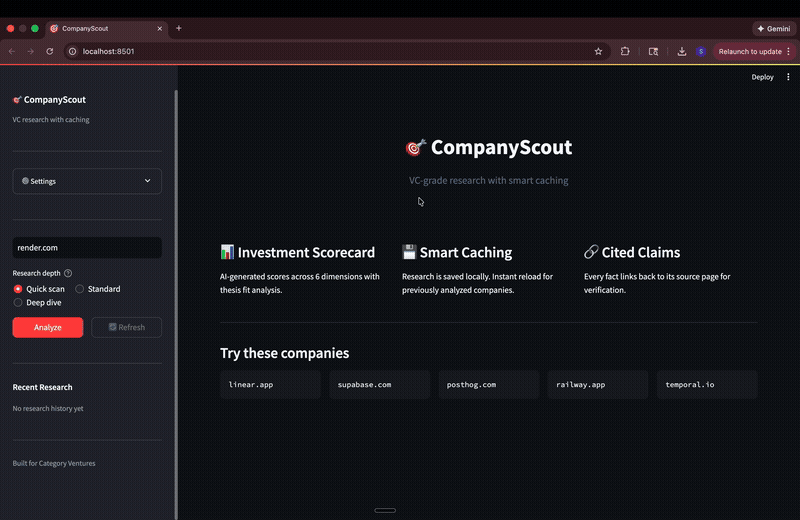

# CompanyScout

VC-grade company research tool with AI-powered analysis, source citations, and smart caching.



## Features

- **Instant Company Research** — Enter any company URL, get a structured investment brief
- **Investment Scorecard** — AI-generated scores (1-10) across 6 dimensions with reasoning
- **Source Citations** — Every claim links back to its source page for verification
- **Smart Caching** — Research is saved locally; instant reload for previously analyzed companies
- **Hybrid Search Chat** — Ask follow-up questions using semantic + keyword search
- **Deal Memo Generator** — One-click investment memo with thesis, risks, and recommendation
- **Diligence Questions** — Auto-generated questions specific to each company

## Quick Start

### 1. Clone & Install

```bash
git clone https://github.com/suhaasteja/CompanyScoutAgent.git
cd CompanyScoutAgent
pip install -r requirements.txt
```

### 2. Set up API Key

**Option A:** Create `.env` file
```bash
cp .env.example .env
# Edit .env and add your OpenAI API key
```

**Option B:** Enter in UI
- Launch the app and enter your key in the Settings panel

### 3. Run

```bash
streamlit run app.py
```

Open http://localhost:8501 and try: `linear.app`, `supabase.com`, or `posthog.com`

## How It Works

```
Enter URL → Discover Pages → Scrape Content → LLM Extraction → Display
                                    ↓
                            Save to SQLite + ChromaDB
                                    ↓
                            Instant reload next time
```

### Tech Stack

| Component | Technology |
|-----------|------------|
| UI | Streamlit |
| LLM | OpenAI GPT-4o-mini |
| Embeddings | OpenAI text-embedding-3-small |
| Vector DB | ChromaDB |
| Database | SQLite |
| Scraping | requests + BeautifulSoup |

### Research Depth Options

| Mode | Pages | Speed |
|------|-------|-------|
| Quick scan | 5 | ~10s |
| Standard | 10 | ~20s |
| Deep dive | 18 | ~40s |

## Data Extracted

- Company name & description
- Industry & business model
- Founders & team size
- Tech stack
- Key products
- Funding stage & investors
- Hiring signals
- Competitive advantages
- Potential risks

All fields include source URLs for verification.

## Investment Scoring

Each company is scored (1-10) on:

| Dimension | What it measures |
|-----------|------------------|
| Market | Size & growth of the market |
| Team | Founder/team quality indicators |
| Product | Uniqueness & defensibility |
| Model | Revenue model clarity |
| Timing | Market timing & trends |
| Overall | Holistic investment attractiveness |

Hover over any score to see reasoning and sources.

## Limitations

- **Website-only data** — No financials, no growth metrics, no private data
- **Cloudflare-protected sites** — Some sites block scraping (e.g., openai.com, stripe.com)
- **LLM judgment** — Scores are AI-generated, not financial advice

## Sites That Work Well

```
linear.app, supabase.com, posthog.com, railway.app,
vercel.com, temporal.io, modal.com, replicate.com,
huggingface.co, anthropic.com, notion.so, figma.com
```

## Project Structure

```
CompanyScoutAgent/
├── app.py              # Main Streamlit application
├── company_analyzer.py # LLM-powered data extraction
├── storage.py          # SQLite + ChromaDB storage
├── requirements.txt    # Python dependencies
├── .env.example        # API key template
└── data/               # Local database (gitignored)
```

## Contributing

PRs welcome! Areas for improvement:
- External data sources (Crunchbase, LinkedIn, GitHub)
- Company comparison mode
- Batch analysis
- Export to Notion/Airtable

## License

MIT
