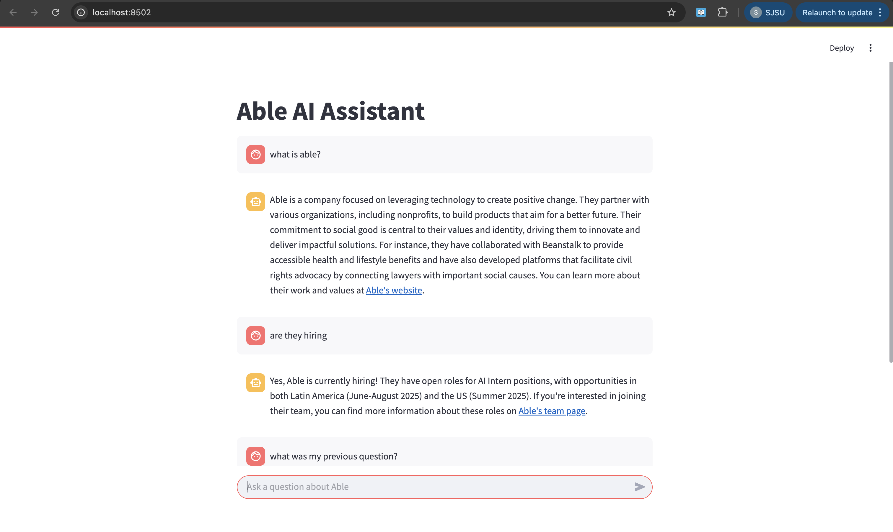

# CompanyScoutAgent

**CompanyScoutAgent** is an AI-powered chatbot and research automation framework to answer questions about any company using web-scraped content, advanced embeddings, and a flexible chat UI. It is built for use cases spanning market research, competitive intelligence, and internal knowledge assistants.

***

## Project Preview



***

## Features

- **Automated Domain Crawler**: Recursively crawls a target website (using Scrapy), collects URL metadata, and respects robots.txt and crawl depth.
- **Intelligent Web Scraper**: Processes discovered URLs, cleans content via [Docling](https://github.com/veriphor/docling), and exports structured markdown.
- **Semantic Vector Search**: Converts scraped content into OpenAI embeddings and loads into a Chroma vector database for fast similarity search.
- **Conversational Chatbot Interface (RAG) **: Streamlit-powered frontend with memory, context, and integration of LLM retrieval/response logic.
- **Dynamic Research Agents**: Includes modular CrewAI agent templates for market research (e.g., FAANG analysis) and LinkedIn/social content generation.
- **Modular Pipeline**: Each step (crawling, scraping, embedding, retrieval, UI) can be independently run, customized, or extended.

***

## Quick Start

### 1. Clone the Repository

```bash
git clone https://github.com/suhaasteja/CompanyScoutAgent
cd CompanyScoutAgent
```

### 2. Install Dependencies

```bash
pip install -r requirements.txt
```

### 3. Set API Keys

Set your OpenAI API key (and Serper API key for web search, if CrewAI agents are used):

```bash
# .env file in repo root
OPENAI_API_KEY=your_openai_key
SERPER_API_KEY=your_serper_api_key   # if using web search
```

***

## Pipeline Usage

#### 1. Crawl Target Domain

```bash
python crawler.py https://example.com --max-depth 2 --output-file domain_urls.csv
```
- Crawls and indexes URLs, titles, and status within the domain.

#### 2. Scrape Structured Content

```bash
python scraper.py
```
- Uses Docling to extract clean markdown content from each URL.

#### 3. Build Vector Database

```bash
python vectordb_setup.py
```
- Splits markdown into semantic chunks, embeds with OpenAI, stores in Chroma DB.

#### 4. Launch the Chatbot

```bash
streamlit run retriever.py
```
- Opens a Streamlit conversational assistant leveraging both vector DB and LLM logic.

***

## Additional Functionality

- **crew_test.py**: Agent demo file with:
  - Research agent for FAANG market analysis (with real-time web search and scraping capabilities).
  - LinkedIn content/post generator agent leveraging LLMs and custom search tools.
- **Data Artifacts**:
  - `domain_urls.csv`: Discovered site structure.
  - `website_scrape.csv`: Clean page content and titles.
- **Embeddings/Vector DB**:
  - Uses OpenAI's `"text-embedding-3-large"` by default.
  - Chroma DB persisted to disk for fast access.

***

## Architecture Diagram

```
                +--------------------+
                |   Target Website   |
                +--------------------+
                         |
           1. Crawl URLs |
                         v
                +--------------------+
                |   crawler.py       | --(CSV: domain_urls.csv)-->
                +--------------------+
                         |
        2. Scrape & Clean|
                         v
                +--------------------+
                |   scraper.py       | --(CSV: website_scrape.csv)-->
                +--------------------+
                         |
         3. Embed & Index|
                         v
                +--------------------+
                | vectordb_setup.py  | --(Chroma DB)-->
                +--------------------+
                         |
    4. Chat/Research/Retrieval UI   |
                         v
                +--------------------+
                |  retriever.py (+    |
                |     CrewAI agents)  |
                +--------------------+
```

***

## Requirements

- Python 3.8+
- See `requirements.txt` for all Python dependencies.

***

## Credits

- [Scrapy](https://scrapy.org/) for crawling
- [Docling](https://github.com/veriphor/docling) for robust HTML to markdown conversion
- [LangChain](https://python.langchain.com/) and [ChromaDB](https://www.trychroma.com/) for AI retrieval
- [Streamlit](https://streamlit.io/) for the UI
- [OpenAI](https://platform.openai.com/) for LLM and embeddings
- [CrewAI](https://github.com/joaomdmoura/crewAI) for multi-agent coordination tools

***

## Contributing

Pull requests welcome! Please open an issue to discuss feature ideas or bugs.

***

**Questions or feedback?**  
Please create an issue or reach out via [GitHub Discussions](https://github.com/suhaasteja/CompanyScoutAgent/discussions).

***
